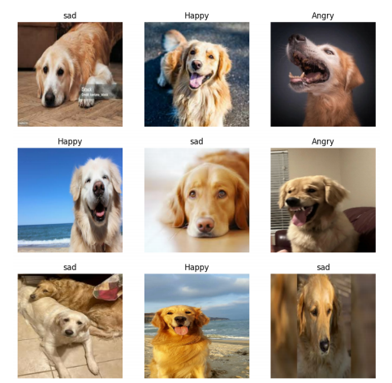
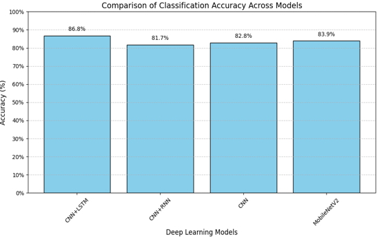
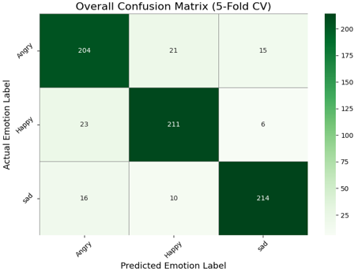
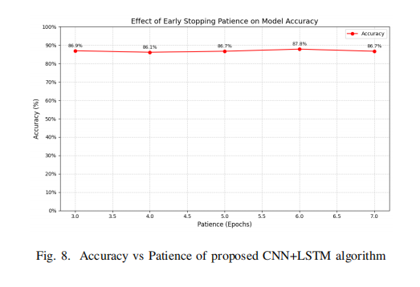

# Dog Emotion Recognition Using Deep Learning

A deep learning-based computer vision system for recognizing emotional states in Golden Retriever dogs from facial and behavioral imagery.

This project explores the application of Convolutional Neural Networks (CNNs), MobileNetV2, and hybrid CNN-LSTM architectures for canine emotion classification. The work contributes to the growing field of animal-centered artificial intelligence by enabling automated recognition of emotional cues from visual data.

---

## Overview

Understanding animal emotions plays an important role in improving human-animal interaction, veterinary care, behavioral analysis, and animal welfare.

This project focuses on classifying Golden Retriever dog images into distinct emotional categories using deep learning techniques. Multiple architectures were evaluated and compared to identify the most effective approach for emotion recognition.

---

## Key Features

* Image-based dog emotion classification
* Deep learning model training and evaluation
* Comparative analysis of multiple architectures
* Performance visualization and metric reporting
* Research publication and conference presentation
* Publicly available dataset for reproducibility

---

## Dataset

The dataset was curated specifically for Golden Retriever emotion recognition and contains labeled images representing multiple emotional states.

### Emotion Categories

* Happy
* Sad
* Angry

### Dataset Source

Kaggle Dataset:

https://www.kaggle.com/datasets/adharasaniveekshitha/golden-retriever-emotion-recognition-dataset

Example structure:

dataset/
├── happy/
├── sad/
└── angry/

---

## Methodology

The project follows a complete deep learning pipeline:

1. Data Collection and Preparation
2. Image Preprocessing
3. Model Development
4. Training and Validation
5. Performance Evaluation
6. Comparative Analysis

### Evaluated Models

* CNN + RNN
* CNN
* MobileNetV2
* CNN + LSTM (Proposed Architecture)

---

## Project Visualizations

### System Architecture

The proposed pipeline combines image preprocessing, sequence modeling, and a hybrid CNN-LSTM architecture for emotion classification.

---

### Sample Dataset Images

Representative samples from the dataset showing different emotional categories.

---

### Model Comparison

Performance comparison across evaluated deep learning architectures.

---

### Confusion Matrix

Overall confusion matrix generated using 5-Fold Cross Validation.

---

### Hyperparameter Analysis

Impact of Early Stopping Patience on model performance.

## Results

### Model Comparison

| Model          | Accuracy   | Precision  | Recall     | F1 Score   |
| -------------- | ---------- | ---------- | ---------- | ---------- |
| CNN + RNN      | 81.67%     | 33.05%     | 32.78%     | 32.52%     |
| CNN            | 82.78%     | 83.95%     | 82.78%     | 82.38%     |
| MobileNetV2    | 83.89%     | 82.24%     | 82.22%     | 82.16%     |
| **CNN + LSTM** | **86.81%** | **87.28%** | **86.81%** | **86.79%** |

### Best Performing Model

The proposed CNN-LSTM hybrid architecture achieved the highest performance across all evaluation metrics, demonstrating the effectiveness of combining spatial feature extraction with sequential pattern learning.

| Metric    | Score  |
| --------- | ------ |
| Accuracy  | 86.81% |
| Precision | 87.28% |
| Recall    | 86.81% |
| F1 Score  | 86.79% |

---

## Repository Structure

├── Emotion_Recognition_of_Golden_Retriever_Dogs_Code.ipynb
├── Dog_Emotion_Table.ipynb
├── Research_Paper.pdf
├── Conference_Paper.pdf
├── Presentation_Slides.pptx
└── README.md

---

## Research Publication

### Emotion Recognition of Golden Retriever Using Deep Learning

Accepted and presented at:

International Conference on Communication and Smart Devices (ICCoSD 2025)

The research investigates the application of deep learning techniques for automated canine emotion recognition and evaluates the effectiveness of hybrid neural network architectures for emotion classification tasks.

---

## Citation

If you use this work in research or academic projects, please cite:

Chintala, S., Acharya, D. S., Adharasani, V., & Shireen, R. (2025).

Emotion Recognition of Golden Retriever Using Deep Learning.

2025 International Conference on Communication and Smart Devices (ICCoSD), IEEE.

---

## Authors

**Veekshitha Adharasani**

GitHub: https://github.com/VeekshithaAdharasani

Google Scholar: https://scholar.google.com/citations?user=D9pPL58AAAAJ&hl=en

Kaggle Dataset: https://www.kaggle.com/datasets/adharasaniveekshitha/golden-retriever-emotion-recognition-dataset

### Co-Authors

* Sridhar Chintala
* Deep Shekhar Acharya
* Rida Shireen
